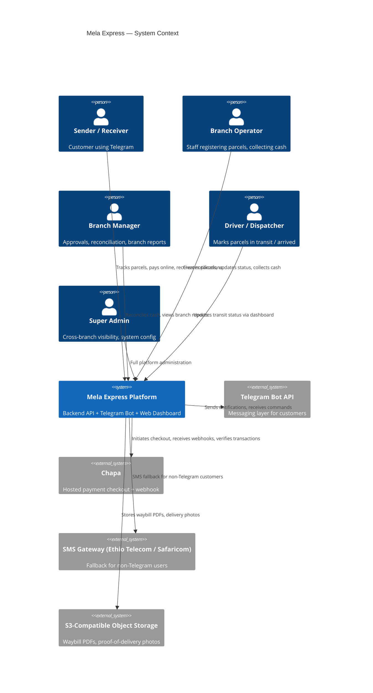
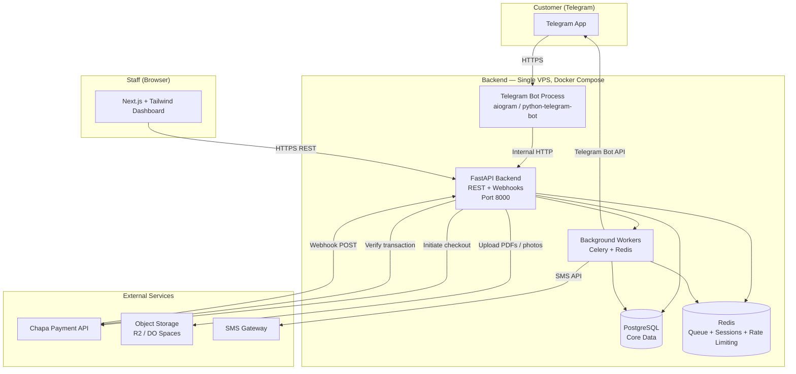
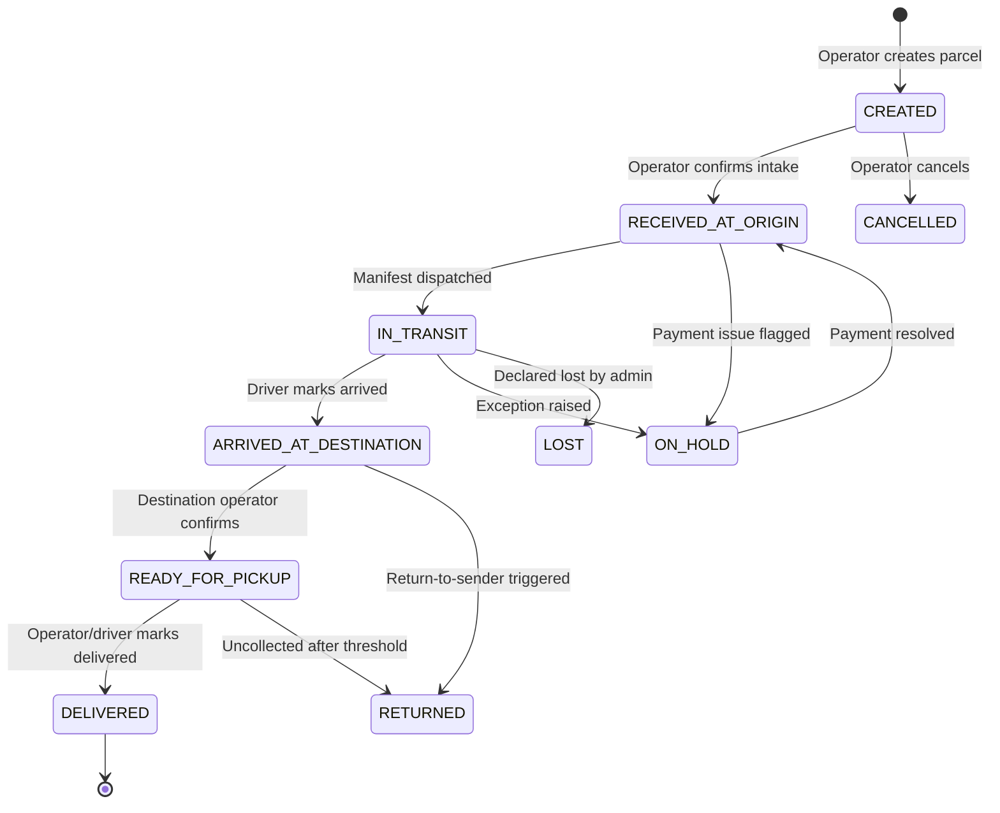
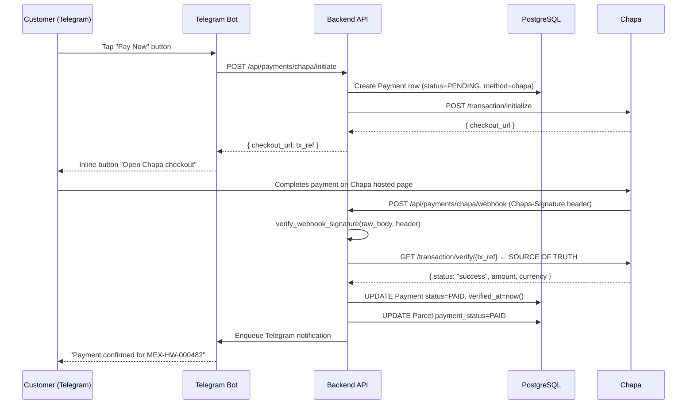
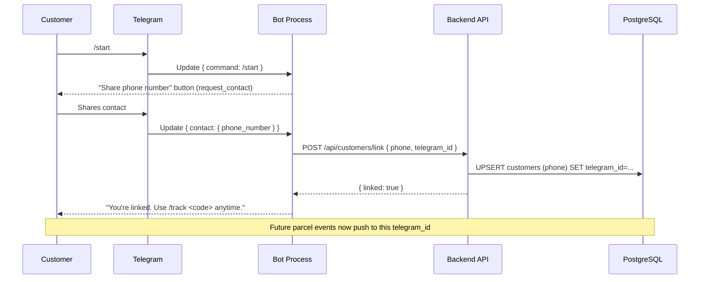
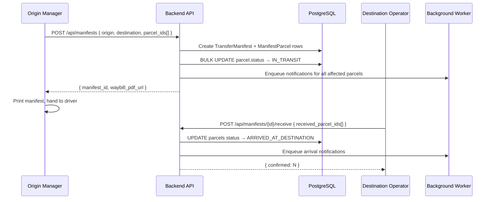

# Design Document: Mela Express Platform

## Overview

Mela Express is a full digital operations and tracking system for a multi-branch parcel delivery company operating across Ethiopia (Addis Ababa ×4, Hawassa, Adama, Dire Dawa, Jijiga, and growing). The platform replaces a fully manual operation with a central backend that is the single source of truth for every parcel, branch, operator, and payment. Customers interact exclusively through a Telegram bot; operators and admins work through a web dashboard; Chapa handles all online payments with a parallel manual cash path.

The core architectural insight is that **the parcel is the central object** around which every other concern (payments, notifications, manifests, reporting) revolves. The existing `mela-express-backend/` codebase provides a working skeleton — FastAPI, SQLAlchemy async, Chapa integration, Telegram bot, and a Celery-ready notifications service — and this design extends and productionises that foundation rather than replacing it.

---

## Part 1 — High-Level Design

### 1.1 System Context Diagram



### 1.2 Container Diagram



### 1.3 Parcel Status State Machine



Every state transition:
- Writes a `parcel_status_history` row with timestamp, operator ID, branch ID, and optional note.
- Enqueues a Telegram/SMS notification via the background worker (never inline in the DB transaction).
- Broadcasts a real-time dashboard update via WebSocket or Server-Sent Events.

### 1.4 Payment Flow



### 1.5 Telegram Bot Registration Flow



### 1.6 Inter-Branch Transfer Flow



### 1.7 Components and Interfaces

#### 1.7.1 Backend API (FastAPI)

**Purpose**: The single source of truth. All clients — bot, dashboard, SMS gateway — call the API. No client touches the database directly.

**Router groups**:

```python
# Auth
POST   /api/auth/login                  # Staff login → JWT
POST   /api/auth/refresh

# Customers
POST   /api/customers/link              # Link telegram_id ↔ phone
GET    /api/customers/me/parcels        # All parcels for calling customer's phone

# Parcels
POST   /api/parcels                     # Create parcel (operator)
GET    /api/parcels                     # List / filter (staff, scoped by branch RBAC)
GET    /api/parcels/{id}                # Full detail with status history
GET    /api/parcels/track/{code}        # Public tracking lookup (rate-limited)
PATCH  /api/parcels/{id}/status        # Advance state machine
GET    /api/parcels/{id}/waybill       # Generate + return PDF URL

# Payments
POST   /api/payments/cash/{parcel_id}/collect
POST   /api/payments/chapa/initiate
POST   /api/payments/chapa/webhook     # Chapa calls this

# Manifests (inter-branch transfer)
POST   /api/manifests
GET    /api/manifests
GET    /api/manifests/{id}
POST   /api/manifests/{id}/receive

# Staff / Users (admin only)
GET    /api/branches
POST   /api/branches
GET    /api/staff
POST   /api/staff
PATCH  /api/staff/{id}

# Reports (manager/admin)
GET    /api/reports/cash-reconciliation
GET    /api/reports/branch-performance
GET    /api/reports/operator-overrides
GET    /api/reports/delay-alerts
```

#### 1.7.2 Telegram Bot Process

**Purpose**: Thin adapter. Contains zero business logic — every meaningful action is an HTTP call to the backend API. Runs as a separate process (`python -m app.bot.bot`).

**Command / handler map**:

| Trigger | Handler | API Call |
|---|---|---|
| `/start` | `start()` | — presents phone-share button |
| Contact shared | `handle_contact()` | `POST /api/customers/link` |
| `/track <code>` | `track()` | `GET /api/parcels/track/{code}` |
| "My Parcels" button | `my_parcels()` | `GET /api/customers/me/parcels` |
| "Pay Now" callback | `handle_pay_button()` | `POST /api/payments/chapa/initiate` |
| "Confirm receipt" callback | `handle_confirm_receipt()` | `PATCH /api/parcels/{id}/status` |

#### 1.7.3 Background Workers (Celery + Redis)

**Purpose**: Decouple all slow / unreliable I/O (Telegram API, SMS API, PDF generation, webhook retries) from the hot DB transaction path.

**Task inventory**:

| Task | Trigger | Behaviour |
|---|---|---|
| `send_telegram_notification` | Status change, payment event | Calls Telegram sendMessage; retries 3× with backoff |
| `send_sms_notification` | No telegram_id on customer | Calls SMS gateway |
| `generate_waybill_pdf` | Parcel created | Renders HTML template → PDF → uploads to S3 |
| `check_transit_delays` | Celery beat, every hour | Finds parcels IN_TRANSIT > threshold; alerts admins |
| `daily_manager_digest` | Celery beat, 07:00 EAT daily | Sends branch summary to manager Telegram/email |
| `retry_failed_webhook` | Celery beat, every 15 min | Re-verifies PENDING payments older than 10 min |

#### 1.7.4 Admin / Operator Web Dashboard (Next.js)

**Purpose**: Primary interface for all staff roles.

**Page map**:

| Route | Roles | Key Actions |
|---|---|---|
| `/dashboard` | All staff | KPI snapshot for their branch |
| `/parcels` | Operator+ | List, filter by status/date |
| `/parcels/new` | Operator+ | Intake form (fast, minimal clicks) |
| `/parcels/[id]` | Operator+ | Detail + status update + waybill |
| `/manifests` | Operator+ | View / create inter-branch manifests |
| `/manifests/[id]/receive` | Operator (dest) | Bulk confirm arrival |
| `/cash` | Manager+ | Daily cash reconciliation |
| `/reports` | Manager+ | Revenue, performance, exceptions |
| `/admin/branches` | Admin | Branch CRUD |
| `/admin/staff` | Admin | Staff CRUD, role assignment |
| `/admin/overrides` | Admin | Operator override audit log |

### 1.8 Data Models

#### Full Database Schema

```sql
-- Branches
CREATE TABLE branches (
    id          UUID PRIMARY KEY DEFAULT gen_random_uuid(),
    name        VARCHAR(120) NOT NULL,
    city        VARCHAR(80)  NOT NULL,
    code        VARCHAR(5)   NOT NULL UNIQUE,  -- e.g. "HW", "AA1", "DD"
    address     TEXT,
    phone       VARCHAR(30),
    is_active   BOOLEAN NOT NULL DEFAULT TRUE
);

-- Staff
CREATE TABLE staff_users (
    id          UUID PRIMARY KEY DEFAULT gen_random_uuid(),
    name        VARCHAR(120) NOT NULL,
    phone       VARCHAR(30)  NOT NULL UNIQUE,
    email       VARCHAR(255),
    password_hash VARCHAR(255) NOT NULL,
    role        staff_role_enum NOT NULL,  -- operator | manager | driver | admin
    branch_id   UUID REFERENCES branches(id),
    is_active   BOOLEAN NOT NULL DEFAULT TRUE,
    created_at  TIMESTAMPTZ NOT NULL DEFAULT NOW()
);

-- Customers (senders/receivers)
CREATE TABLE customers (
    id          UUID PRIMARY KEY DEFAULT gen_random_uuid(),
    phone       VARCHAR(30) NOT NULL UNIQUE,
    telegram_id VARCHAR(40) UNIQUE,
    name        VARCHAR(120),
    created_at  TIMESTAMPTZ NOT NULL DEFAULT NOW()
);

-- Parcels (central entity)
CREATE TABLE parcels (
    id                    UUID PRIMARY KEY DEFAULT gen_random_uuid(),
    tracking_code         VARCHAR(30) NOT NULL UNIQUE,  -- MEX-HW-000482
    origin_branch_id      UUID NOT NULL REFERENCES branches(id),
    destination_branch_id UUID NOT NULL REFERENCES branches(id),
    sender_id             UUID NOT NULL REFERENCES customers(id),
    receiver_id           UUID REFERENCES customers(id),  -- NULL until receiver links
    receiver_name         VARCHAR(120) NOT NULL,
    receiver_phone        VARCHAR(30)  NOT NULL,
    description           TEXT,
    weight_kg             NUMERIC(6,2),
    size_category         size_category_enum,  -- small | medium | large | oversized
    declared_value        NUMERIC(10,2),
    price                 NUMERIC(10,2) NOT NULL,
    payment_mode          payment_mode_enum NOT NULL,   -- before | after
    payment_method        payment_method_enum,          -- cash | chapa
    payment_status        payment_status_enum NOT NULL DEFAULT 'pending',
    status                parcel_status_enum  NOT NULL DEFAULT 'created',
    created_by            UUID NOT NULL REFERENCES staff_users(id),
    created_at            TIMESTAMPTZ NOT NULL DEFAULT NOW(),
    updated_at            TIMESTAMPTZ NOT NULL DEFAULT NOW()
);
CREATE INDEX idx_parcels_tracking_code ON parcels(tracking_code);
CREATE INDEX idx_parcels_status        ON parcels(status);
CREATE INDEX idx_parcels_created_at    ON parcels(created_at DESC);
```

```sql
-- Audit log for every status transition
CREATE TABLE parcel_status_history (
    id          UUID PRIMARY KEY DEFAULT gen_random_uuid(),
    parcel_id   UUID NOT NULL REFERENCES parcels(id),
    from_status parcel_status_enum,
    to_status   parcel_status_enum NOT NULL,
    changed_by  UUID REFERENCES staff_users(id),
    branch_id   UUID REFERENCES branches(id),
    note        TEXT,
    timestamp   TIMESTAMPTZ NOT NULL DEFAULT NOW()
);
CREATE INDEX idx_psh_parcel_id ON parcel_status_history(parcel_id);

-- Payments
CREATE TABLE payments (
    id           UUID PRIMARY KEY DEFAULT gen_random_uuid(),
    parcel_id    UUID NOT NULL REFERENCES parcels(id),
    amount       NUMERIC(10,2) NOT NULL,
    method       payment_method_enum NOT NULL,
    chapa_tx_ref VARCHAR(100) UNIQUE,
    status       payment_status_enum NOT NULL DEFAULT 'pending',
    override_reason TEXT,       -- required when operator manually marks paid
    collected_by UUID REFERENCES staff_users(id),
    verified_at  TIMESTAMPTZ,
    created_at   TIMESTAMPTZ NOT NULL DEFAULT NOW()
);
CREATE INDEX idx_payments_chapa_tx_ref ON payments(chapa_tx_ref);

-- Inter-branch transfer manifests
CREATE TABLE transfer_manifests (
    id                    UUID PRIMARY KEY DEFAULT gen_random_uuid(),
    origin_branch_id      UUID NOT NULL REFERENCES branches(id),
    destination_branch_id UUID NOT NULL REFERENCES branches(id),
    created_by            UUID NOT NULL REFERENCES staff_users(id),
    status                manifest_status_enum NOT NULL DEFAULT 'open',  -- open | dispatched | received
    dispatched_at         TIMESTAMPTZ,
    received_at           TIMESTAMPTZ,
    created_at            TIMESTAMPTZ NOT NULL DEFAULT NOW()
);

CREATE TABLE manifest_parcels (
    manifest_id UUID NOT NULL REFERENCES transfer_manifests(id),
    parcel_id   UUID NOT NULL REFERENCES parcels(id),
    PRIMARY KEY (manifest_id, parcel_id)
);

-- Notification delivery log
CREATE TABLE notification_log (
    id              UUID PRIMARY KEY DEFAULT gen_random_uuid(),
    parcel_id       UUID REFERENCES parcels(id),
    recipient_telegram_id VARCHAR(40),
    recipient_phone VARCHAR(30),
    channel         VARCHAR(20) NOT NULL,  -- telegram | sms
    message         TEXT        NOT NULL,
    status          VARCHAR(20) NOT NULL DEFAULT 'queued',  -- queued | sent | failed
    sent_at         TIMESTAMPTZ,
    created_at      TIMESTAMPTZ NOT NULL DEFAULT NOW()
);

-- Proof of delivery
CREATE TABLE proof_of_delivery (
    id          UUID PRIMARY KEY DEFAULT gen_random_uuid(),
    parcel_id   UUID NOT NULL UNIQUE REFERENCES parcels(id),
    photo_url   TEXT,
    signature_url TEXT,
    notes       TEXT,
    recorded_by UUID REFERENCES staff_users(id),
    created_at  TIMESTAMPTZ NOT NULL DEFAULT NOW()
);
```

### 1.9 Security Model

| Concern | Mechanism |
|---|---|
| Staff authentication | JWT (access 15 min + refresh 7 days), bcrypt password hashing |
| RBAC enforcement | FastAPI dependency `require_role(...)` on every protected route |
| Branch scoping | Operators can only read/write parcels where `origin_branch_id` or `destination_branch_id` matches their `branch_id` |
| Chapa webhook integrity | HMAC-SHA256 signature verification before reading payload; then server-side `/transaction/verify` call as ground truth |
| Tracking code enumeration | Non-sequential suffix (`random.randint`) + rate limit on `/track` (10 req/min per IP via Redis) |
| Manual override audit | `override_reason` field required; surfaced in `/api/reports/operator-overrides` |
| Monetary atomicity | All payment + parcel status updates in a single DB transaction |
| Secrets management | All credentials in `.env` / Docker secrets — never in source or logs |
| HTTPS | Nginx reverse proxy with Let's Encrypt termination |

### 1.10 Error Handling

| Scenario | Handling |
|---|---|
| Chapa webhook arrives for unknown `tx_ref` | 404 response; Chapa will retry — log and alert |
| Duplicate webhook (idempotency) | Check `payment.status == PAID` before acting; return `200 ok, already processed` |
| Chapa verify API unreachable | Mark payment `PENDING` and enqueue `retry_failed_webhook` task |
| Telegram API timeout in notification | Worker retries 3× with exponential backoff; on final failure logs to `notification_log.status=failed` |
| Invalid state transition | `400` with message; state machine enforces allowed transitions in a validator function |
| Branch operator accesses wrong branch | `403 Forbidden` from RBAC dependency |
| PDF generation failure | Log error; waybill endpoint returns `503` with retry guidance; parcel is not blocked |

### 1.11 Performance Considerations

- All DB queries use async SQLAlchemy with connection pooling (`pool_size=10`, `max_overflow=20`).
- Tracking code lookup uses a `UNIQUE` index — O(log n) regardless of parcel count.
- Notification dispatch is fully async via Celery workers — no inline Telegram/SMS calls in the request path.
- The Chapa webhook endpoint is designed to be idempotent and returns quickly; all heavy work (PDF, notifications) is queued.
- Redis caches JWT validation and rate-limit counters.
- PostgreSQL `parcel_status_history` is append-only — no UPDATE, safe for high-concurrency audit logs.
- Waybill PDFs are generated once and stored on S3; subsequent requests return the stored URL.

### 1.12 Dependencies

| Package | Purpose | Pinned Version |
|---|---|---|
| `fastapi` | Backend API framework | 0.115.0 |
| `uvicorn[standard]` | ASGI server | 0.30.6 |
| `sqlalchemy[asyncio]` | ORM + async engine | 2.0.35 |
| `asyncpg` | PostgreSQL async driver | 0.29.0 |
| `alembic` | DB migrations | 1.13.2 |
| `pydantic` / `pydantic-settings` | Validation + config | 2.9.2 / 2.5.2 |
| `httpx` | Async HTTP client | 0.27.2 |
| `python-telegram-bot` | Telegram bot | 21.6 |
| `celery[redis]` | Task queue | 5.4.x |
| `redis` | Celery broker + cache | 5.x |
| `passlib[bcrypt]` | Password hashing | 1.7.4 |
| `python-jose[cryptography]` | JWT | 3.3.0 |
| `weasyprint` or `reportlab` | PDF waybill generation | latest stable |
| `boto3` | S3-compatible storage | 1.34.x |
| `sentry-sdk[fastapi]` | Error monitoring | 2.x |

Infrastructure:
- PostgreSQL 16
- Redis 7
- Docker Compose (single VPS deployment)
- Nginx (reverse proxy + TLS termination)
- GitHub Actions (CI/CD)


---

## Part 2 — Low-Level Design

### 2.1 Tracking Code Generation

```python
async def generate_tracking_code(db: AsyncSession, origin_branch: Branch) -> str:
    """
    Preconditions:
        - origin_branch.code is a 2–5 character uppercase string (e.g. "HW", "AA1")
        - db session is open and flushed

    Postconditions:
        - Returns a string matching r'^MEX-[A-Z0-9]{2,5}-\d{6}$'
        - The returned code does not exist in parcels.tracking_code
        - Raises HTTPException(500) after MAX_RETRIES consecutive collisions

    Loop invariant:
        - On each iteration, candidate is a fresh random code not yet confirmed unique
    """
    MAX_RETRIES = 10
    prefix = f"MEX-{origin_branch.code.upper()}"

    for attempt in range(MAX_RETRIES):
        # 6-digit random suffix → 1,000,000 permutations per branch
        # Non-sequential: does not leak shipment volume to enumerators
        suffix = random.randint(100_000, 999_999)
        candidate = f"{prefix}-{suffix}"

        result = await db.execute(
            select(Parcel.id).where(Parcel.tracking_code == candidate)
        )
        if result.scalar_one_or_none() is None:
            return candidate

    raise HTTPException(500, detail="Tracking code generation failed after retries")
```

### 2.2 State Machine Validator

```python
ALLOWED_TRANSITIONS: dict[ParcelStatus, set[ParcelStatus]] = {
    ParcelStatus.CREATED: {
        ParcelStatus.RECEIVED_AT_ORIGIN,
        ParcelStatus.CANCELLED,
    },
    ParcelStatus.RECEIVED_AT_ORIGIN: {
        ParcelStatus.IN_TRANSIT,
        ParcelStatus.ON_HOLD,
        ParcelStatus.CANCELLED,
    },
    ParcelStatus.IN_TRANSIT: {
        ParcelStatus.ARRIVED_AT_DESTINATION,
        ParcelStatus.ON_HOLD,
        ParcelStatus.LOST,
    },
    ParcelStatus.ARRIVED_AT_DESTINATION: {
        ParcelStatus.READY_FOR_PICKUP,
        ParcelStatus.RETURNED,
    },
    ParcelStatus.READY_FOR_PICKUP: {
        ParcelStatus.DELIVERED,
        ParcelStatus.RETURNED,
    },
    ParcelStatus.ON_HOLD: {
        ParcelStatus.RECEIVED_AT_ORIGIN,
        ParcelStatus.IN_TRANSIT,
        ParcelStatus.CANCELLED,
    },
    # Terminal states — no outbound transitions
    ParcelStatus.DELIVERED: set(),
    ParcelStatus.RETURNED:  set(),
    ParcelStatus.CANCELLED: set(),
    ParcelStatus.LOST:      set(),
}


def validate_transition(from_status: ParcelStatus, to_status: ParcelStatus) -> None:
    """
    Preconditions:
        - from_status and to_status are valid ParcelStatus values

    Postconditions:
        - Returns None if transition is allowed
        - Raises ValueError with descriptive message if transition is forbidden

    This is a pure function — no side effects, safe to call before opening a transaction.
    """
    allowed = ALLOWED_TRANSITIONS.get(from_status, set())
    if to_status not in allowed:
        raise ValueError(
            f"Transition {from_status!r} → {to_status!r} is not permitted. "
            f"Allowed: {sorted(s.value for s in allowed)}"
        )
```

### 2.3 Parcel Creation Algorithm

```python
async def create_parcel(
    payload: ParcelCreate,
    current_user: StaffUser,
    db: AsyncSession,
) -> Parcel:
    """
    Preconditions:
        - payload passes Pydantic validation
        - current_user.role in {OPERATOR, MANAGER, ADMIN}
        - current_user.branch_id == payload.origin_branch_id  (RBAC enforced by caller)
        - origin_branch and destination_branch exist and are active

    Postconditions:
        - Parcel row inserted with status=CREATED, payment_status=PENDING
        - ParcelStatusHistory row inserted (from_status=None, to_status=CREATED)
        - Customer row created or retrieved for sender_phone
        - tracking_code is globally unique and follows MEX-{BRANCH_CODE}-{6DIGIT} format
        - Waybill PDF generation task enqueued (async, non-blocking)
        - Intake notifications enqueued for sender (and receiver if telegram_id known)

    Atomicity: All DB writes are in a single transaction. Notification tasks are
    enqueued AFTER commit to ensure they reference committed data.
    """
    origin = await _get_active_branch_or_404(db, payload.origin_branch_id)
    destination = await _get_active_branch_or_404(db, payload.destination_branch_id)
    sender = await _get_or_create_customer(db, payload.sender_phone)
    tracking_code = await generate_tracking_code(db, origin)

    parcel = Parcel(
        tracking_code=tracking_code,
        origin_branch_id=origin.id,
        destination_branch_id=destination.id,
        sender_id=sender.id,
        receiver_name=payload.receiver_name,
        receiver_phone=payload.receiver_phone,
        description=payload.description,
        weight_kg=payload.weight_kg,
        size_category=payload.size_category,
        declared_value=payload.declared_value,
        price=payload.price,
        payment_mode=payload.payment_mode,
        payment_method=payload.payment_method,
        status=ParcelStatus.CREATED,
        payment_status=PaymentStatus.PENDING,
        created_by=current_user.id,
    )
    db.add(parcel)
    await db.flush()  # get parcel.id before history insert

    db.add(ParcelStatusHistory(
        parcel_id=parcel.id,
        from_status=None,
        to_status=ParcelStatus.CREATED,
        changed_by=current_user.id,
        branch_id=origin.id,
    ))
    await db.commit()
    await db.refresh(parcel)

    # Post-commit side effects (non-blocking)
    generate_waybill_pdf.delay(str(parcel.id))
    if sender.telegram_id:
        send_telegram_notification.delay(
            telegram_id=sender.telegram_id,
            message=f"Parcel {tracking_code} created. Track anytime with /track {tracking_code}",
        )

    return parcel
```

### 2.4 Status Update Algorithm

```python
async def update_parcel_status(
    parcel_id: UUID,
    payload: ParcelStatusUpdate,
    current_user: StaffUser,
    db: AsyncSession,
) -> Parcel:
    """
    Preconditions:
        - Parcel with parcel_id exists
        - current_user has write access to this parcel (RBAC)
        - payload.to_status is a valid transition from parcel.status (validated below)
        - If payload.to_status == DELIVERED and parcel.payment_mode == BEFORE:
            parcel.payment_status MUST be PAID (enforced here)

    Postconditions:
        - parcel.status == payload.to_status
        - parcel.updated_at == now()
        - New ParcelStatusHistory row committed
        - Notification enqueued for sender (and receiver if known)

    Payment gate enforcement:
        Prepaid parcels (payment_mode=BEFORE) are blocked from advancing past
        RECEIVED_AT_ORIGIN until payment_status=PAID, unless current_user is
        MANAGER/ADMIN and provides an override_note.
    """
    parcel = await db.get(Parcel, parcel_id)
    if parcel is None:
        raise HTTPException(404, "Parcel not found")

    # RBAC: operator can only touch their branch's parcels
    if current_user.role == StaffRole.OPERATOR:
        if parcel.origin_branch_id != current_user.branch_id and \
           parcel.destination_branch_id != current_user.branch_id:
            raise HTTPException(403, "Access denied: parcel belongs to another branch")

    # State machine validation (pure, no side effects)
    try:
        validate_transition(parcel.status, payload.to_status)
    except ValueError as e:
        raise HTTPException(400, str(e))

    # Payment gate
    PAYMENT_BLOCKED_STATUSES = {
        ParcelStatus.IN_TRANSIT,
        ParcelStatus.ARRIVED_AT_DESTINATION,
        ParcelStatus.READY_FOR_PICKUP,
        ParcelStatus.DELIVERED,
    }
    if (parcel.payment_mode == PaymentMode.BEFORE
            and parcel.payment_status != PaymentStatus.PAID
            and payload.to_status in PAYMENT_BLOCKED_STATUSES):
        if not payload.override_note or current_user.role not in {StaffRole.MANAGER, StaffRole.ADMIN}:
            raise HTTPException(
                402,
                "Payment required before advancing this parcel. "
                "Managers may override with a reason."
            )

    from_status = parcel.status
    parcel.status = payload.to_status
    db.add(ParcelStatusHistory(
        parcel_id=parcel.id,
        from_status=from_status,
        to_status=payload.to_status,
        changed_by=current_user.id,
        branch_id=current_user.branch_id,
        note=payload.note,
    ))
    await db.commit()
    await db.refresh(parcel)

    # Non-blocking notifications
    sender = await db.get(Customer, parcel.sender_id)
    dest_branch = await db.get(Branch, parcel.destination_branch_id)
    branch_name = dest_branch.name if dest_branch else ""

    for telegram_id in [sender.telegram_id if sender else None]:
        if telegram_id:
            send_status_notification.delay(
                telegram_id=telegram_id,
                tracking_code=parcel.tracking_code,
                branch_name=branch_name,
                to_status=payload.to_status.value,
                note=payload.note,
            )

    return parcel
```

### 2.5 Chapa Webhook Algorithm

```python
async def chapa_webhook(request: Request, db: AsyncSession) -> dict:
    """
    Preconditions:
        - Request contains raw body and Chapa-Signature header
        - settings.chapa_webhook_secret is set

    Postconditions:
        - If signature invalid → 401, no DB writes
        - If tx_ref unknown → 404, no DB writes
        - If already PAID → 200 idempotent no-op, no DB writes
        - If Chapa verify returns status == "success":
            payment.status = PAID, payment.verified_at = now()
            parcel.payment_status = PAID
            Telegram confirmation enqueued
        - All DB writes in a single atomic transaction
        - Response always returns within 5 seconds (Chapa timeout expectation)

    Security invariants:
        1. NEVER trust the webhook payload status field alone
        2. ALWAYS call Chapa's verify endpoint as ground truth
        3. ALWAYS verify HMAC signature before processing anything
        4. Idempotency check prevents double-crediting on retried webhooks
    """
    raw_body = await request.body()
    signature = request.headers.get("Chapa-Signature", "")

    if not verify_webhook_signature(raw_body, signature):
        raise HTTPException(401, "Invalid webhook signature")

    payload = await request.json()
    tx_ref = payload.get("tx_ref")
    if not tx_ref:
        raise HTTPException(400, "Missing tx_ref")

    result = await db.execute(
        select(Payment).where(Payment.chapa_tx_ref == tx_ref)
    )
    payment = result.scalar_one_or_none()
    if payment is None:
        raise HTTPException(404, "Unknown transaction reference")

    # Idempotency guard
    if payment.status == PaymentStatus.PAID:
        return {"ok": True, "note": "already processed"}

    # Server-side verification — this is the actual source of truth
    try:
        verified_data = await verify_transaction(tx_ref)
    except ChapaError:
        # Chapa verify unreachable — leave PENDING, retry worker will handle it
        retry_failed_webhook.apply_async(args=[tx_ref], countdown=600)
        return {"ok": True, "note": "verification deferred"}

    async with db.begin():
        if verified_data.get("status") != "success":
            payment.status = PaymentStatus.FAILED
        else:
            payment.status = PaymentStatus.PAID
            payment.verified_at = datetime.now(timezone.utc)
            parcel = await db.get(Parcel, payment.parcel_id)
            parcel.payment_status = PaymentStatus.PAID
            parcel.payment_method = PaymentMethod.CHAPA

    if payment.status == PaymentStatus.PAID:
        sender = await db.get(Customer, parcel.sender_id)
        if sender and sender.telegram_id:
            send_payment_confirmation.delay(
                telegram_id=sender.telegram_id,
                tracking_code=parcel.tracking_code,
                amount=float(payment.amount),
            )

    return {"ok": True}
```

### 2.6 RBAC Dependency

```python
from functools import wraps
from typing import Callable

def require_roles(*roles: StaffRole) -> Callable:
    """
    FastAPI dependency factory.

    Preconditions:
        - Request carries a valid JWT (enforced by get_current_user dependency)

    Postconditions:
        - Returns current StaffUser if user.role in roles
        - Raises HTTPException(403) otherwise

    Usage:
        @router.post("/parcels")
        async def create_parcel(
            payload: ParcelCreate,
            user: StaffUser = Depends(require_roles(StaffRole.OPERATOR, StaffRole.MANAGER, StaffRole.ADMIN))
        ):
            ...
    """
    async def dependency(current_user: StaffUser = Depends(get_current_user)) -> StaffUser:
        if current_user.role not in roles:
            raise HTTPException(
                status_code=403,
                detail=f"Role '{current_user.role}' is not permitted for this operation."
            )
        return current_user
    return dependency
```

### 2.7 Transfer Manifest — Bulk Receive Algorithm

```python
async def receive_manifest(
    manifest_id: UUID,
    received_parcel_ids: list[UUID],
    current_user: StaffUser,
    db: AsyncSession,
) -> dict:
    """
    Preconditions:
        - Manifest exists and status == DISPATCHED
        - current_user.branch_id == manifest.destination_branch_id
        - received_parcel_ids is a subset of manifest's parcel IDs

    Postconditions:
        - All received parcels: status → ARRIVED_AT_DESTINATION
        - Missing parcels (in manifest but not in received list): status → ON_HOLD with auto-note
        - Manifest status → RECEIVED, received_at = now()
        - One ParcelStatusHistory row per affected parcel
        - Bulk arrival notifications enqueued

    Loop invariant:
        - Each iteration processes exactly one parcel; DB state is consistent after each flush
    """
    manifest = await db.get(TransferManifest, manifest_id)
    if manifest is None:
        raise HTTPException(404, "Manifest not found")
    if manifest.status != ManifestStatus.DISPATCHED:
        raise HTTPException(400, "Manifest is not in DISPATCHED state")
    if manifest.destination_branch_id != current_user.branch_id:
        raise HTTPException(403, "This manifest is not for your branch")

    result = await db.execute(
        select(ManifestParcel.parcel_id).where(ManifestParcel.manifest_id == manifest_id)
    )
    manifest_parcel_ids = {row[0] for row in result.fetchall()}
    received_set = set(received_parcel_ids)
    missing_set = manifest_parcel_ids - received_set

    for pid in received_set & manifest_parcel_ids:
        parcel = await db.get(Parcel, pid)
        validate_transition(parcel.status, ParcelStatus.ARRIVED_AT_DESTINATION)
        parcel.status = ParcelStatus.ARRIVED_AT_DESTINATION
        db.add(ParcelStatusHistory(
            parcel_id=pid, from_status=ParcelStatus.IN_TRANSIT,
            to_status=ParcelStatus.ARRIVED_AT_DESTINATION,
            changed_by=current_user.id, branch_id=current_user.branch_id,
        ))

    for pid in missing_set:
        parcel = await db.get(Parcel, pid)
        parcel.status = ParcelStatus.ON_HOLD
        db.add(ParcelStatusHistory(
            parcel_id=pid, from_status=ParcelStatus.IN_TRANSIT,
            to_status=ParcelStatus.ON_HOLD,
            changed_by=current_user.id, branch_id=current_user.branch_id,
            note="Not received in manifest — placed on hold for investigation",
        ))

    manifest.status = ManifestStatus.RECEIVED
    manifest.received_at = datetime.now(timezone.utc)
    await db.commit()

    bulk_arrival_notifications.delay(
        parcel_ids=[str(p) for p in received_set & manifest_parcel_ids],
        branch_id=str(current_user.branch_id),
    )

    return {
        "received": len(received_set & manifest_parcel_ids),
        "missing": len(missing_set),
        "missing_parcel_ids": [str(p) for p in missing_set],
    }
```

### 2.8 Correctness Properties

*A property is a characteristic or behavior that should hold true across all valid executions of a system — essentially, a formal statement about what the system should do. Properties serve as the bridge between human-readable specifications and machine-verifiable correctness guarantees.*

---

### Property 1: Tracking Code Format and Uniqueness

*For any* parcel created in the system, its `tracking_code` SHALL match the regular expression `^MEX-[A-Z0-9]{2,5}-\d{6}$`, and no two parcels SHALL share the same tracking code.

**Validates: Requirements 1.2, 14.7**

---

### Property 2: State Machine Determinism

*For any* pair `(from_status, to_status)` of valid parcel statuses, calling `validate_transition(from_status, to_status)` with the same inputs always produces the same result (allowed or rejected) — the function is pure and side-effect-free.

**Validates: Requirements 3.1**

---

### Property 3: State Machine Transition Validity

*For any* row in `parcel_status_history` where `from_status` is not `NULL`, `to_status` SHALL be a member of `ALLOWED_TRANSITIONS[from_status]`.

**Validates: Requirements 3.1, 3.2, 3.9**

---

### Property 4: Terminal State Irreversibility

*For any* terminal status (`DELIVERED`, `RETURNED`, `CANCELLED`, `LOST`) and any target status, `validate_transition` SHALL raise an error — no outbound transitions are permitted from terminal states.

**Validates: Requirements 3.9**

---

### Property 5: Payment Gate Invariant

*For any* parcel where `payment_mode == BEFORE` and `payment_status != PAID`, submitting a status transition to `IN_TRANSIT`, `ARRIVED_AT_DESTINATION`, `READY_FOR_PICKUP`, or `DELIVERED` as an Operator (without Manager/Admin override) SHALL be rejected with HTTP 402.

**Validates: Requirements 3.6**

---

### Property 6: Payment Gate Override Records Note

*For any* Manager or Admin override of the payment gate where an `override_note` is provided, the resulting `parcel_status_history` row SHALL contain that note verbatim.

**Validates: Requirements 3.7**

---

### Property 7: Chapa Webhook Signature Verification

*For any* raw request body and signature string, `verify_webhook_signature(body, signature)` SHALL return `True` if and only if the HMAC-SHA256 of the body with the configured secret matches the provided signature — the function is pure and deterministic.

**Validates: Requirements 4.2, 14.1**

---

### Property 8: Chapa Payment Atomicity

*For any* successful Chapa verification response, the platform SHALL atomically update `payment.status = PAID`, `payment.verified_at = now()`, and `parcel.payment_status = PAID` — either all three fields are updated together or none are.

**Validates: Requirements 4.5, 14.3**

---

### Property 9: Chapa Webhook Idempotency

*For any* `tx_ref` already in `PAID` status, a subsequent webhook delivery for that same `tx_ref` SHALL result in no additional database writes and SHALL return `200 OK`.

**Validates: Requirements 4.7, 14.8**

---

### Property 10: Cash Payment Requires Override Reason

*For any* payment record created via the manual override path where `method == CASH`, `override_reason` SHALL be non-empty (not null, not blank).

**Validates: Requirements 5.2**

---

### Property 11: Branch RBAC Scoping

*For any* Staff_User with role `OPERATOR`, any API request to read or modify a parcel where neither `origin_branch_id` nor `destination_branch_id` matches the operator's `branch_id` SHALL be rejected with HTTP 403.

**Validates: Requirements 1.9, 3.8, 9.4, 9.5**

---

### Property 12: JWT Protection on Protected Routes

*For any* protected API route, any request that lacks a valid JWT SHALL receive HTTP 401 Unauthorized — regardless of the route, method, or payload.

**Validates: Requirements 9.3**

---

### Property 13: Password Hashing Round-Trip

*For any* plaintext password, the value stored in `staff_users.password_hash` SHALL NOT equal the plaintext, and `bcrypt.verify(password, stored_hash)` SHALL return `True`.

**Validates: Requirements 9.7**

---

### Property 14: Notification Conditional on Telegram Linkage

*For any* parcel status change or payment confirmation event, a Telegram notification task SHALL be enqueued if and only if the sender's Customer record has a non-null `telegram_id`; otherwise an SMS task SHALL be enqueued instead.

**Validates: Requirements 1.7, 3.4, 4.6, 7.1, 7.2**

---

### Property 15: Notification Retry Behaviour

*For any* Telegram notification task that fails on delivery, the Worker SHALL retry up to exactly 3 times using exponential backoff before recording a final `failed` status in `notification_log`.

**Validates: Requirements 7.3, 15.1**

---

### Property 16: Notification Log Completeness

*For any* notification attempt (sent, failed, or queued), THE Worker SHALL create a `notification_log` row capturing the channel, message, status, and timestamp — no notification dispatch occurs without a corresponding log entry.

**Validates: Requirements 7.4**

---

### Property 17: Parcel Status Audit Trail

*For any* parcel, the count of rows in `parcel_status_history` for that parcel SHALL be at least 1 (the initial `CREATED` transition), and SHALL increase by exactly 1 for each subsequent status transition.

**Validates: Requirements 1.5, 3.3**

---

### Property 18: Customer Phone Upsert

*For any* phone number and `telegram_id` pair submitted to `POST /api/customers/link`, the platform SHALL produce exactly one Customer row for that phone number, with `telegram_id` set to the most recently linked value — calling link twice with the same phone SHALL not create duplicate Customer records.

**Validates: Requirements 17.1**

---

### Property 19: Rate Limiting on Public Tracking Endpoint

*For any* IP address, after 10 requests to `GET /api/parcels/track/{code}` within a 60-second window, the 11th and subsequent requests SHALL receive HTTP 429 Too Many Requests for the remainder of that window.

**Validates: Requirements 2.2, 14.6**

---

### Property 20: Manifest Receive Completeness

*For any* manifest receive operation where the submitted `received_parcel_ids` is a strict subset of the manifest's parcel IDs, every parcel in the manifest BUT NOT in `received_parcel_ids` SHALL transition to `ON_HOLD`, and every parcel in `received_parcel_ids` SHALL transition to `ARRIVED_AT_DESTINATION` — with exactly one `parcel_status_history` row created per affected parcel.

**Validates: Requirements 8.4, 8.5, 8.9**

---

### Property 21: Waybill Generation Idempotency

*For any* parcel that already has a stored waybill URL, requesting `GET /api/parcels/{id}/waybill` again SHALL return the existing URL without enqueuing a new PDF generation task.

**Validates: Requirements 12.3, 18.3**

### 2.9 Testing Strategy

#### Unit Tests

- `test_validate_transition`: all 10×10 transition combinations, assert correct allow/deny
- `test_generate_tracking_code`: format matches regex, uniqueness enforced on collision simulation
- `test_verify_webhook_signature`: valid HMAC passes, tampered body fails, missing secret fails
- `test_payment_gate`: prepaid parcel blocked at OPERATOR level, allowed with manager override
- `test_rbac_dependency`: role matrix coverage across all route groups

#### Property-Based Tests (Hypothesis)

```python
from hypothesis import given, strategies as st

@given(
    from_status=st.sampled_from(list(ParcelStatus)),
    to_status=st.sampled_from(list(ParcelStatus)),
)
def test_transition_determinism(from_status, to_status):
    """validate_transition is pure — same inputs always produce same result."""
    try:
        result1 = validate_transition(from_status, to_status)
    except ValueError:
        result1 = "error"
    try:
        result2 = validate_transition(from_status, to_status)
    except ValueError:
        result2 = "error"
    assert result1 == result2

@given(city_code=st.text(alphabet=st.characters(whitelist_categories=('Lu',)), min_size=2, max_size=5))
def test_tracking_code_format(city_code):
    """Generated codes always match the expected pattern."""
    # mock DB always returns no collision
    ...
```

#### Integration Tests

- Full parcel lifecycle: CREATE → RECEIVED → IN_TRANSIT → ARRIVED → READY → DELIVERED
- Chapa payment flow: initiate → webhook → verify → parcel marked paid
- RBAC: operator from Branch A cannot modify Branch B parcel
- Manifest bulk-receive: partial receipt puts missing parcels ON_HOLD
